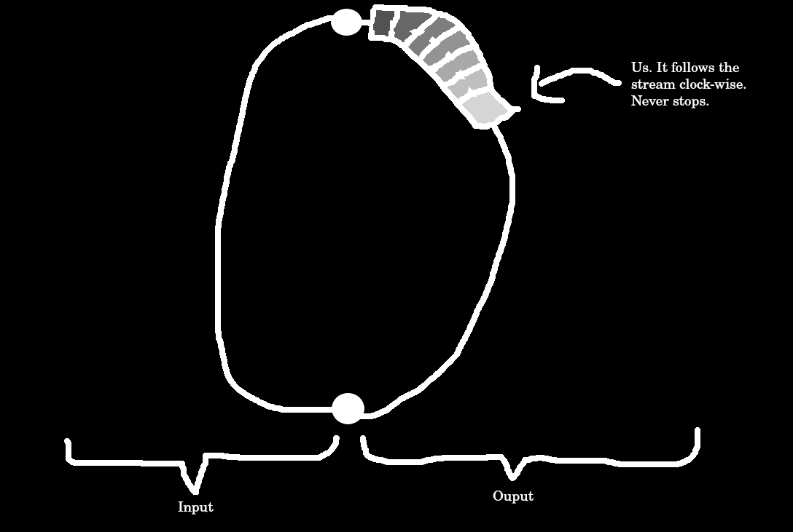
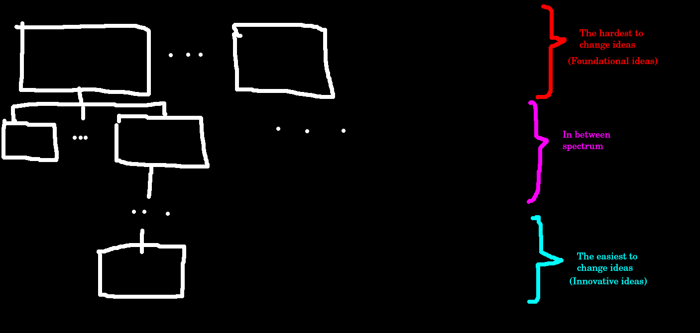
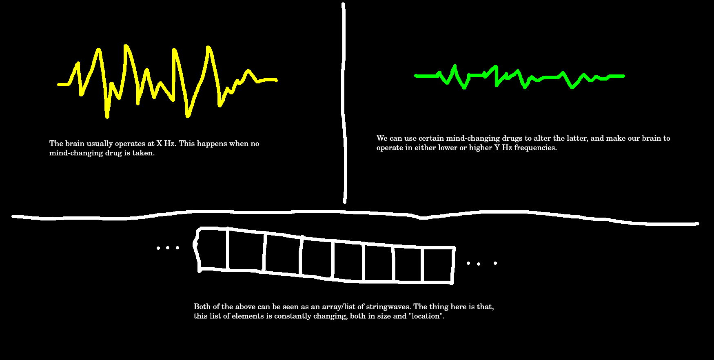
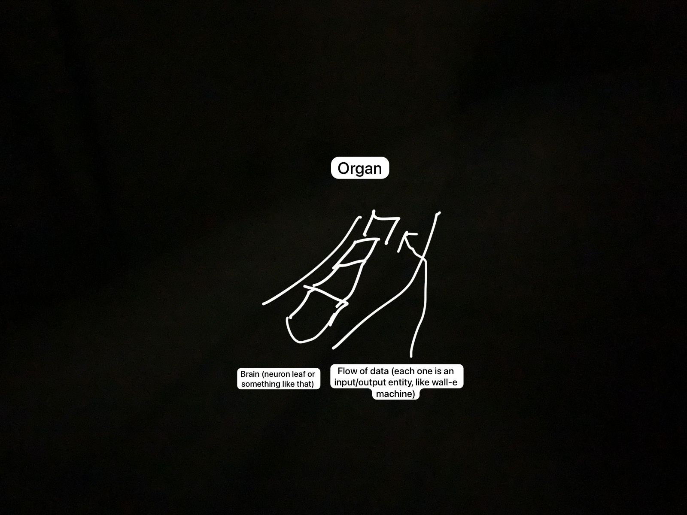
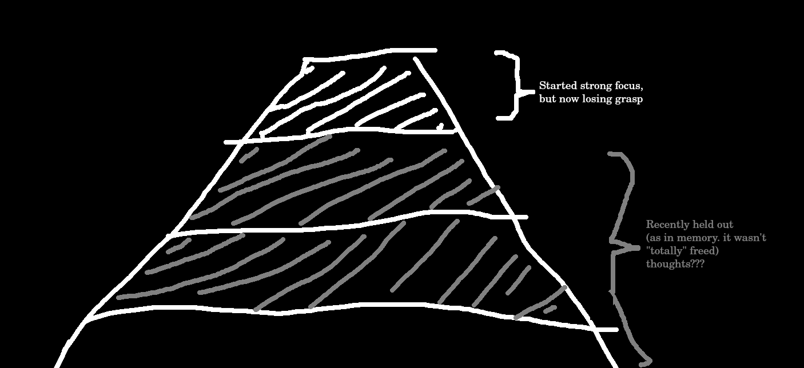
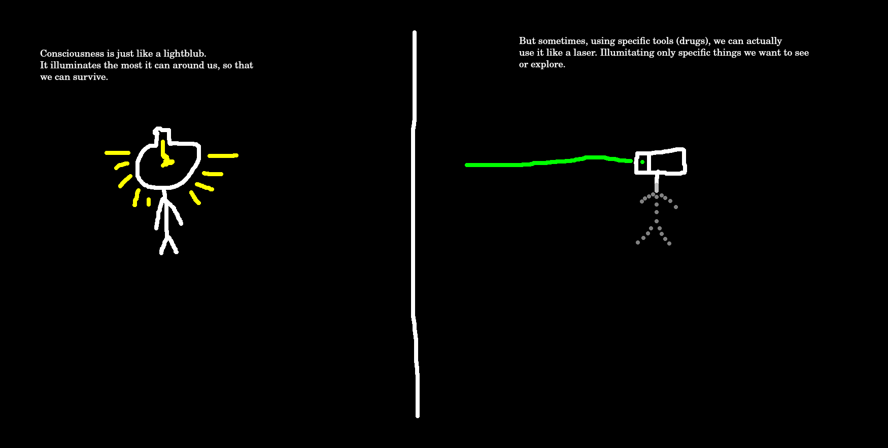

<p align="center">

</p>
<h1 align="center">Cipactónal</h1>
<p align="center">
<i>:mexico: In Quetzalcóātl Ehecailacocozcatl, in Huitzilopochtli tlalli, in cehcāyotl.</i>
<br \>
<i>:us: Created by gods, he represents the balanced nature of existence.</i>
<hr />
</p>

This is Cipactónal, my take on trying to imitate in the most simplistic way the human mind.

# Contents

- [Main Theory](#main-theory)
  - [Consciousness](#consciousness)
    - [Intuition](#intuition)
    - [Foreground](#foreground)
      - Short term memory
  - [Subconsciousness](#subconsciousness)
    - [Ideas](#ideas)
    - [Feelings](#feelings)
    - [Imagination](#imagination)
    - [Perception](#perception)
    - [Background](#background)
      - Long term memory
  - [Environment](#environment)
    - [Focus](#focus)
- [Implementation](#implementation)
- [Other theories](#other-theories)
  - [Hertz](#hertz)
  - [Neuron-to-organ communication](#neuron-to-organ-communication)
  - [Focus2](#focus2)
- [Where did this come from? - The Lightbulb Analogy](#where-did-this-come-from---the-lightbulb-analogy)
- [FAQ](#faq)

# Main Theory

## Consciousness
This is what we *usually* define as "us" (though a more accurate way of seeing "us" is by joining both consciousness and subconsciousness).

Consciousness is basically a non-stopping flow of data that operates within two fields of work: **Input** and **Output**. It receives **input** from mostly external sources and based on that it creates an **output** using both internal and external methods. This flow of data is a _"constantly moving"_ array/list of elements. In these elements there are our [Ideas](#ideas) present, as well as our [Feelings](#feelings), and [Imagination](#imagination) —in this section I'll explain the overall description of consciousness for the average reader while each of the previous topics will describe in a more computer-like theory what each is and how each works.

If we were to see this as a game it would most definitely be a Snake game, but the snake would not be able to cross the map boundaries and the snake would be tied to move in a circular motion (clock-wise); as one would expect, this flow of data has a **velocity** (Hz frequencies for humans) and a **location**. 

<p align="center">

</p>

Take a normal day-to-day conversation between two people, for example. When one of them is talking, his consciousness is moving down the stream in the **Output** region, making several moves and zig-zags as it goes (each of the latter representing actions like "tilt head", "move hand", or "speak"), while the consciousness of the other person is moving up the stream in the **Input** region, also making several moves and zig-zags as it goes (in this case, most of the *moves* are internal processes, like "prepare to be happy because of so many gifts" or "save to short term memory that Sarah is a bitch"). These **moves** and **zig-zags** are basically dictated by our [Foreground](#foreground) system and this decision-making entity basically wants to *"reach"* different positions in the map; this is why the shape of the figure (the circle) will change on a daily basis based on what we are doing on each specific moment. Human-wise, the scope of each region varies significantly from person to person.

Sometimes, random points/dots will appear on the "map" with a random location so that "we" can "collect" them. And I call them, [Imagination](#imagination).

Have you ever came across a person that cannot keep their mouth shut and always end up saying the most ridiculous and offensive things in front of other people? Well, I believe their consciousness legitimately cannot supress any [Thought](#thoughts) given by the subconscious on how to react to certain estimuli, so their conscious them just end up accepting these ideas and reacting accordingly.

### Intuition

These are basically actions that we perform purely by instinct. If an idea is far up in the tree, actions taken with that idea in mind can be considered instinct as well.

### Foreground

This is our decision-making entity, the tip/head in the constantly-moving list of elements. Decisions are taken based on their effects on...
- Self
- Others

## Subconsciousness
If we were to see the things that happen inside the human mind as a 3D platform game, the conscious would be the player and the subconscious would be everything else the player can interact with, from the platform itself to collectables and checkpoints/targets.

Think of a number between 1 and 100 and only continue reading once you have decided your number. Ready? Let me tell you that your **conscious you** didn't come up with that number, but your **subconscious you** did. Your conscious you only **accepted** the number your subconscious you came up with; this also happens if you stuttered between two or more numbers to choose from, since all of those options were created by your subconscious you as well.

**There is no *conscious you* without your *subconscious you***, and viceversa. I bet Computer Science people can now probably see a little more clear the difference between the two of them with the first analogy, but here is another analogy for the average reader: your *conscious you* is Jerry from the movie [Soul (2020)](https://en.wikipedia.org/wiki/Soul_(2020_film)), while your *subconscious you* is Terry. **Jerry feels, Terry orders**. However, with the latter analogy one has to be clear in something: it **does not** mean at all that there are "two different human beings" inside our heads. Both consciousness and subconsciousness are what we define as "us". Seeing these parts of us that way is just convinient and easy to understand.

These are the main responsabilities for the subconscious:

1. Generate thoughts and offer them to the conscious.
1. Order memory.
1. Sort things up, like what to keep in the long term memory.
  
  - One cannot be conscious of everything

### Ideas
Ideas are what makes us _"us"_.

They all can be seen as data structure trees since there are **Foundational Ideas** (root nodes) and **Innovative Ideas** (leaf nodes). Each node must have a `hierarchy` value and a `content` value. The `hierarchy` value is an integer —which is basically the height of the node— and it represents how easily can the node be modified in any way (with 0 being close to if not straight up impossible). The `content` value holds several logic gates which, in a whole, represents the idea per se.

One example of an idea in a human being could be `"I am shy"`. Let's say this idea has `hierarchy = 10`, and it has a couple of hundred children nodes, each one and each of its children representing other ideas such as `"I cannot make lots of friends"` or `"I cannot start a conversation"`. From this, and taking into consideration that in this hypothetical tree the distance from `"I am shy"` to one of its leaves is, let's say, `50`, we could very firmly say the idea `"I am shy"` is a **Core Idea** and it won't be changed unless other several couple hundred ideas change as well.

Have you ever wondered why so many people claim they cannot lose weight, yet very few go from astonishingly morbid to exceptionally thin? Well, their conscious them had to manually modify ideas within themselves somewhere in the process of losing weight. In a sense, these people claiming they cannot lose weight are somewhat "right", since this opinion is purely based on their [Ideas](#ideas), and if they are not willing to change them or they are not even aware of the fact that they **can** change them in the first place, then they will not lose weight. However, this does not mean the statement that they cannot lose weight is true at all.

My current intention is to have a preset number of ideas —immutable and omnipresent— that represent several key factors we want Cipactónal to have, such as `"I must express truth"`, or the [Three Laws of Robotics](https://en.wikipedia.org/wiki/Three_Laws_of_Robotics).
<p align="center">

</p>

The following are the different types of ideas (the first field is the content, the second is the hierarchy):

- **Foundational Idea**

  These are very solid ideas that represent extensive and pretty much philosophical concepts; and we, as humans, cannot change any of them at all, since they are extremely deep within ourselves. Here are some examples (I don't really know if any of these are actually part of the human-basic set of Foundational Ideas, I just want to make the concept clear):
    - `["I am real", 0]`
    - `["I am alive", 0]`
    - `["I am a human", 0]`
    - `["I have a personality", 0]`
    - Etc.

- **Core Idea**

  These ideas portray the core concept of how our personality is, and how to express it in the real world (and what our subconscious get to keep in the long-term memory as well). They are generally really hard to change, but with strong effort and dedication anyone can eventually reach them and modify them within themselves, one just has to be conscious of them in the first place. For example:

    - `["I am very good at X activity", n]`
    - `["I cannot do X activity", n]`
    - `["I am extroverted", n]`
    - `["I strongly fear X thing", n]`
    - Etc.

- **Innovative Idea**

  These ideas are new ideas and are generally speaking the leaves in the tree. The most remarcable thing about these is that they are the easiest ideas to change due to its hierarchy.

- **Contradictory Idea**

  A Contradictory Idea is exactly what its name implies: it contradicts an existing idea within ourselves. For example:
    - Existing idea:
      ```
      ["I can reach everything by jumping", 15]
      ```
    - Contradictory idea (something external happens):
      ```
      "I cannot reach dad's chest by jumping"
      ```
    - Action taken by the conscious/subconscious:

      Rename the node `"I can reach everything by jumping"` to:
      ```
      ["I can reach up to X by jumping", 15]
      ```
      With `X` being a unit of measurement only we as individuals can understand.

As you would have probably guessed by now, there must be a clear limit of height for the tree. What I believe right now is that the tree keeps growing until we reach a certain age (between 7 and 10 years old is my guess), then it mostly changes in the order or in the content of the ideas, it eventually stops creating new nodes.

      How to represent an idea:
        `std::string content`
        `std::logical_gates content`?

Finally, conscious us don't get to mess around any of this a lot, since subconsious us deals with inserting and modifying nodes in the tree. Conscious us just get to *feel* that sentiment (which can vary from happiness/joy to straight up confusion/disappointment/sadness).

### Feelings

At any given moment, there is a set of feelings being represented and taken into consideration for both the conscious and subconscious. Most of us work with only **one dominant** feeling (meaning we *can* have more than one feeling being represented, but one of them influence more than 80% of our decisions and actions) while others can have several of them working together in a weird harmony. The less the number of feelings you can handle at the current moment, the better.

Since [Feelings](#feelings) are present on a day-to-day basis, they can be viewed as a constantly-changing pie chart representing percentages for each feeling. This can very roughly be translated as a hash map from string to int: the string represents the name of the feeling, and the int represents how much of it is currently present. For example:

```
[Sadness] -> [0]
[Happiness] -> [97]
[Disgust] -> [2]
[Anger] -> [0]
[Fear] -> [1]
```

The listed strings are based on the movie [Inside-Out](https://en.wikipedia.org/wiki/Inside_Out_(2015_film)). The real human emotions are way more than that, including Love (Oxytocin) for example.

Depending on which kind of ideas define each of us, our [Imagination](#imagination) will create and offer decisions based on them with different types of priorities. E. g., let's say one [Core Idea](#ideas) is `"I get emotional very easily"` or `"X feeling dominates me"`, then our decisions will give a lot of weight to [Feelings](#feelings) and [Emotions](#emotions) when taking each individual decision.


### Imagination

These are the dots that appear in the map from time to time for our Foreground system to collect and decide whether or not it will act accordingly. They are basically a set of instructions to perform.

### Perception

Placeholder.

### Background

Placeholder.

## Environment

Placeholder.

### Focus

If we were to see all of this as a MacOS environment, focus would be the current working Desktop/space. There are more Desktops available and we can switch between working Desktops. One Desktop I am totally sure exists in the human mind is the "Physical Movement" Desktop.

# Other theories
These were never finished, so don't take any of them as part of the main theory.

## Hertz
<p align="center">

</p>

## Neuron-to-organ communication
<p align="center">

</p>

## Focus2
<p align="center">

</p>

# Where did this come from? - The Lightbulb Analogy
One has to have an open mind. After all, where did CPR come from?

<p align="center">

</p>

# FAQ

1. *Why did you leave this unfinished?*

    I had to spend lots of hours a day meditating and/or tripping in order for me to define the most simple concepts in this document. And I did this for months. I cannot afford doing so anymore.

1. *Is it a "he" or a "she"?*

    It is neither. Cipactónal was never coded (at least by me). It does not yet exists per se. Cipactónal is purely the concept. But if it was ever actually created, it would be an "it". **Only humans** can have the "he" and "she" identifiers.

1. *Do you believe this is it? That this is the real deal?*

    Yes. Even though I am sure the human mind is way, way more complex than just a couple of trees, hash maps, and if-like decisions, I firmly believe this is the right track we should follow if we ever want to create an artificial consciousness.

1. Is there anything else left to define?

    I've only defined the groundbase for others to work with. This is my recommended order for further research:
        - Foreground (Conscious): When leading the path for the list of elements, the foreground has to see different ideas offered from the subconscious and it has to decide to which idea head towards to. Once reached, it has to decide whether or not to actually execute it (outputting as in words and physical movement).
        - Background (Subconscious): The subconscious has to make some sort of decision-making when it comes to creating and offering ideas and thoughts to the foreground and this, I suspect, is the background. My only guess here is that the background has to take into consideration key aspects of our personality to create these.
        - What the contents of an Idea are: It's easy to say that a node in the Idea tree has a content string that we humans can read and understand, but what exactly is that content and how do we program it? My initial guess is that it is some sort of logical gates clustered together so that it "means" something to Cipactónal, but I honestly don't know how to begin to define that.

1. *Why the anonymity?*

    I'm just a regular everyday normal motherfucker, just like you. I just don't like attention.

1. *"But your assumptions about people are incorrect since you don't take into consideration crucial things like genetics and bodyshape when it comes to overweight people and blah blah blah"*

    Fuck that. Fuck that and fuck you. Strong-minded motherfuckers get out to the world and achieve their goals in no time. You are just another weak-minded piece of shit.

1. *Does this mean we can now identify ourselves as robots?*

    Fucking kill yourself. Do it now, pussy.

I recently got to know the "Levels of Consciousness" chart created by Ken Wilber. My take on that is that perhaps it can be layed down horizontally in the map so that for example it starts with the infrared closer to the singularity points and ends with ultraviolent ending very far away from it, and all of this mirrored to the other region, the longer the circle becomes the higher the person's consciousness is.

# Some tips for you
All of the people who are deeply interested in finding things about the human mind (consciousness, subconsciousness, sentience, sapience, etc) and pushing their own mental limits in order to do so must have in consideration the following: **Ignorance is not a bliss, but a requirement**. A good mental health is crucial to keeping a *normal* life, and staying ignorant to some specific things about our nature will keep that mind **healthy**. Even after knowing these specific things you can still be ignorant of them on a day-to-day basis. Ingnorance will bring you peace and freedom. ***Stay ignorant***.
